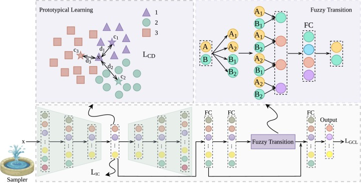

# imFTP: Deep Imbalance Learning via Fuzzy Transition and Prototypical Learning (imFTP, Information Sciences 2024)

This repository contains the Pytorch implementations of the following Information Sciences 2024 paper:

Yaxin Hou, Weiping Ding, Chongsheng Zhang. imFTP: Deep Imbalance Learning via Fuzzy Transition and Prototypical Learning. Information Sciences 2024. &nbsp; &nbsp;[Paper](https://www.sciencedirect.com/science/article/pii/S002002552400985X?via%3Dihub)

## Introduction
 
This work (imFTP) aims to use fuzzy theory and prototypical learning for improving the imbalance learning performance.



Abstract: Although many methods have been proposed for tackling the class-imbalance problem, they still suffer from the insufficient feature representative capability and the overfitting problem. This paper proposes a new deep imbalance learning approach based on the Fuzzy set Theory and the Prototypical learning mechanism, abbreviated as imFTP for short, which consists of an adaptive smooth sampling module, a self-learnable prototypical learning module, and a fuzzy transition module. The adaptive smooth sampling module adaptively adjusts the sampling frequency of different classes to ensure their adequate opportunity to participate in the training process, which can mitigate the overfitting problem. The self-learnable prototypical learning module devises a clustering distance based Softmax cross-entropy loss and an intra-class clustering loss to improve the feature representation and discrimination capability of the model. The fuzzy transition module utilizes the fuzzy set theory to transform sample features effectively, which further enhances the feature representation capability of the model, meanwhile alleviates the overfitting problem. Experimental results on 15 benchmark datasets demonstrate that our method outperforms the best competitor by more than 3% in terms of the Macro-F1 metric, which is very significant.

## Prerequisites

All codes are written by Python 3.8 with:

* Operating System: Windows 10
* torch              1.13.0
* torchaudio         0.13.0
* torchvision        0.14.0
* pandas             1.5.2
* scikit-learn       1.1.3
* imbalanced-learn   0.9.1
* numpy              1.23.5
* openpyxl           3.0.10

## Code structure description

```
   imFTP
   ├──data
   │   ├──original_data  
   │   └──spilted_data
   │
   ├──model
   │   ├──model.png
   │   └──model.py
   │
   ├──result
   │
   ├──trained_model
   │   
   ├──utils
   │   ├──log.py
   │   ├──dataset.py
   │   ├──split_data.py
   │   └──transformer.py 
   │
   ├──imFTP_TRAIN.py
   ├──imFTP_TEST.py
   └──README.MD
```   
  
## Train
  
  To train a classifier for class-imbalanced data:

   ```
   python imFTP_TRAIN.py --dataset mfcc
   ```
  
## Test
 
  To test the classifier with the trained model:

  ```
   python imFTP_TEST.py --dataset mfcc
   ```

## Our Trained models
Under the folder “trained_model”, we have uploaded our trained models for the mfcc dataset.

*  Classification model is at `./trained_model/`

## Citation

If you find our method useful, please consider citing our paper:

  ```
  @inproceedings{imFTP2024,
    title={imFTP: Deep Imbalance Learning via Fuzzy Transition and Prototypical Learning},
    author={Yaxin Hou and Weiping Dingand Chongsheng Zhang},
    booktitle={Information Sciences},
    year={2024},
  }
  ```
